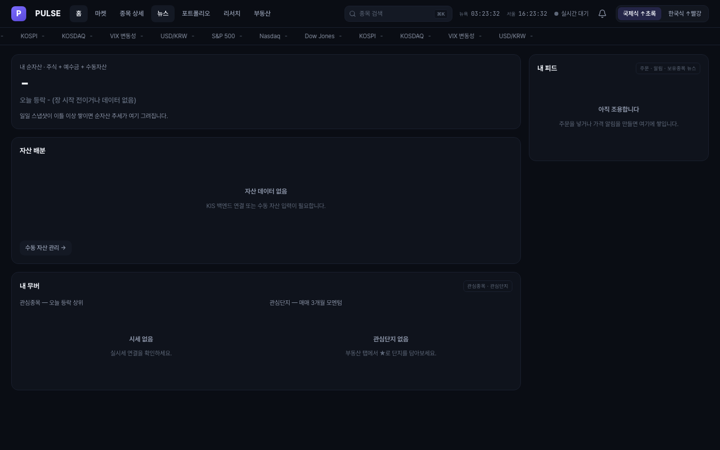

# PULSE — Market Overview Dashboard

[한국어](README.md) | **English**

It's a dark trading-terminal style market dashboard. I've combined indices, heatmaps, sentiment-scored news, real-time Korean orderbooks/ticks, rankings, a paper-trading portfolio (KIS mock account), AI opinions, and technical price targets—all on one screen. Plus, a Korean real estate module with live transaction data and a 3D apartment complex site map.

---

## Screenshots



> Backend disconnected. When there's no real data, it shows `-` instead of a mock value—that's intentional.

## Running

```bash
pnpm install
pnpm dev            # Front dev server (5180)
pnpm server         # Backend proxy (8080) — needed to see real data
pnpm build
pnpm test
pnpm validate       # Pre-commit validation (tsc + tests + color hardcoding + undefined CSS tokens)

pnpm collect        # Real estate transaction batch collection (~6 min)
pnpm server:restart # Kill 8080 listener, restart + health check
```

> API keys go in `server/.env`. **Never push them to frontend or git.**
> `pnpm validate` isn't a warning like hooks—it **blocks the commit**. Run it before committing.

---

## Tech Stack

| Area | Technology |
|---|---|
| UI | React 18 + Vite + TypeScript, Tailwind v3, framer-motion, CSS Modules |
| State | zustand (`src/store/`) |
| Data | `src/data/httpApi.ts` (strangler pattern) — HTTP only for what's ready, mocks for the rest |
| Backend | `server/index.mjs` (Node, 8080) — external API proxy + caching + header spoofing |
| Real-time | KIS WebSocket → server gateway → SSE fanout (`/api/stream`) |
| Path alias | `@` → `src` |

---

## Project Structure

```
src/
├── components/
│   ├── common/       Common UI — Button · Spinner · Loading · Skeleton · Badge
│   │                 Segmented · EmptyState · ErrorState · Modal · ConfirmDialog
│   │                 PriceChart · BarChart · MarketChip · ReasonList
│   ├── dashboard/    IndexCards · Heatmap(treemap) · NewsFeed · RankingBoard
│   │                 Watchlist · AiOpinion · BuffettIndex · FearGreedGauge
│   │                 MacroList · SeoulRentMap
│   ├── detail/       StockDetail · CandleChart · OrderTicket · PriceAlertModal
│   ├── home/         Home · HeroCard · FeedCard · MoversCard · AllocationCard
│   ├── portfolio/    Portfolio · ManualAssets · ReturnChart
│   ├── realestate/   RealEstate · ComplexList/Map/Detail · ComplexTour
│   │                 ComplexSiteMap(3D site map) · DealScatter · LoanCalc · ScreenerFilters
│   ├── news/ research/
│   ├── AppBar · TickerTape · NotificationCenter
├── data/             httpApi.ts(strangler) · mockApi.ts · types.ts(MarketApi contract) · aptSeed.ts
├── lib/              colors(price moves) · kisSocket(SSE parser) · krxTick · chartSeries · treemap
│                     iso(3D coords) · buffett · alertEngine · paperOrders · loan · returns
│                     format · formatRelativeTime · sun · toast · kakaoSdk
├── store/            useModalStore
└── styles/           global.css (CSS variables = single token source)

server/
├── index.mjs         Routes + caching + kisFetch gate
├── opinion.mjs · buffett.mjs · assets.mjs · portfolioHistory.mjs · lib.mjs
└── realestate/       collect · deals · signals · lawd · osm
```

---

## Architecture

The **single source for FE architecture is [`docs/ARCHITECTURE-FE.md`](docs/ARCHITECTURE-FE.md)** (RADIO format:
Requirements → Architecture → Data model → Interface → Optimization/Observability).
Quality goals aren't vague promises like "fast"—they're **numeric SLIs** that we actually keep.

### 5 Invariants (Non-negotiable Rules)

1. **The browser never connects directly to KIS.** Real-time uses one server WebSocket gateway →
   SSE fanout (`/api/stream`) only. Keys, reconnection logic, and rate limits are the server's job.
2. **No real data means `-`, not a mock value.** We use `unavailable` / `targetReal` flags.
   The httpApi failure path never falls back to `mockApi`.
3. **Price move colors are injected.** We only use `signColor(pct, mode)`—no hardcoded hex.
   `colorMode` (global green-up/red-down vs. Korean red-up/blue-down) is global, so components can't pick colors.
4. **Parser contracts are locked with golden tests.** If SSE trade/orderbook field indices change, update the fixture first.
5. **Cache never stores empty success.** A throttle spike's `{}` won't sit in TTL limbo.

### Freshness Targets (SLIs)

| Metric | Target | How |
|---|---|---|
| First tick (SSE connect→) | < 3s | Gateway always-on + onopen resubscribe |
| Korean quotes | Tick-by-tick | KIS ws → SSE fanout |
| US quotes p75 | ≤ 15s | Watchlist polling |
| Indices | ≤ 30s | 30s polling |
| Heatmap | ≤ 60s | 60s polling |
| Portfolio | ≤ 30s | 30s polling |
| News | ≤ 1h | 3-source batch (1h TTL) + manual refresh |

All polling respects `document.hidden` gating.

---

## External API Integration Notes

The hard part of this project wasn't the UI—it was **tolerating other people's APIs**.

- **CNN and data.go.kr block requests without User-Agent.**
- **data.go.kr throttles at 50 concurrent calls**—we throttle to 5 with retries.
- **KIS tokens refresh once per minute**—in-flight dedup + caching handles it.
- **Every KIS call goes through the `kisFetch` gate.** The mock account has a low rate limit;
  if routes fire independently, they knock each other out (measured: 6/10 failures on sequential lookups).
  We use a global serial queue + **adaptive spacing** (×1.6 on 5xx/429, −15ms on success, 200~1600ms range)—brought it down to 0/12 failures.
  Fixed delays are wrong because the limit changes per transaction type.
  > ⚠️ The gate doesn't auto-retry. If retries bubble up to orders (`kisPost`), you get **duplicate orders**.
  > Retry logic is the caller's job.
- **Mock data diverges from reality by 3×+** (Samsung Electronics: 468T market cap in mocks vs. 1.552P real · 12.8 vs. 40.5 P/E).
  That's why invariant #2 exists.

---

## 3D Complex Site Map

`ComplexSiteMap.tsx` + view policy `siteMapView.ts` + coordinates `src/lib/iso.ts`.
We extrude OpenStreetMap building outlines to SVG **without three.js**. Rotation is coordinate math, so no renderer needed.

- Yaw 0~360° continuous, pitch 8~85° (default 30°). Ground depth is `sinφ`, height is `cosφ`.
- **The depth-sort axis must rotate with yaw**—if we sort by world `x+y`, the order flips at 180° and back buildings occlude front ones.
- **OSM ring direction isn't guaranteed** (measured: 451 CCW / 209 CW). If we compute wall normals from ring direction alone, 32% have inverted shading—we check `ringIsCCW` first.
- **LOD** — zoomed out, draw less. Min building area: 0/150/400 m².
- **Streaming surroundings** — 200m grid cells. Cell cache is baked orientation-free and shared **across complexes**.
  When you switch complexes, we cancel in-flight requests and cross-check response `seq` (late responses could place buildings in the wrong coordinate frame).
- **Most subway stations are tunnels**, so applying the geometry rule `isHidden` directly erases entire metro zones. We need to include `residential` roads—major roads alone leave residential areas empty.

---

## Docs

| Document | Content |
|---|---|
| [docs/ARCHITECTURE-FE.md](docs/ARCHITECTURE-FE.md) | FE architecture single source (RADIO) |
| [기능명세.md](기능명세.md) | Detailed specs |
| [CLAUDE.md](CLAUDE.md) | Work rules · design system · color conventions · data patterns |
| [handoff/README.md](handoff/README.md) | Session handoff notes |

---

## Disclaimer

This is a personal learning project. **Not investment advice.**
Until validated, we use **mock KIS accounts only**.
`server/data/` (personal financial data) and `server/.env` (keys) are in `.gitignore`—don't commit them.

---

## License

**Source-available — not open source.** I've made the code readable, but haven't granted usage rights.
To use it in another project, redistribute it, or commercialize it, you need written permission first.
See [LICENSE](LICENSE) for full terms; [LICENSE.ko.md](LICENSE.ko.md) for a Korean summary.
