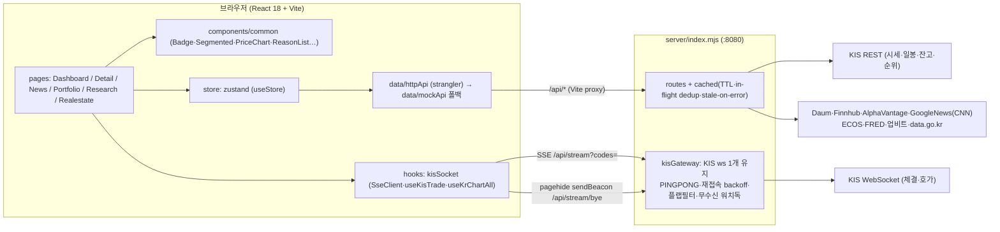
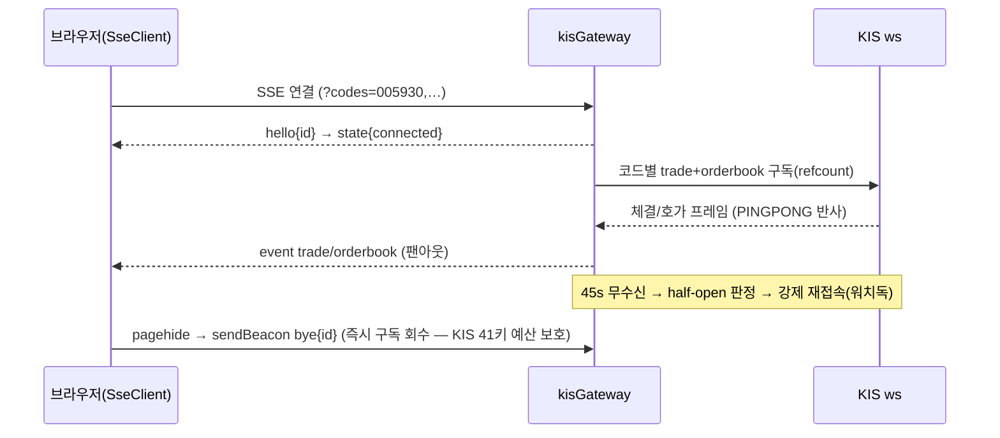
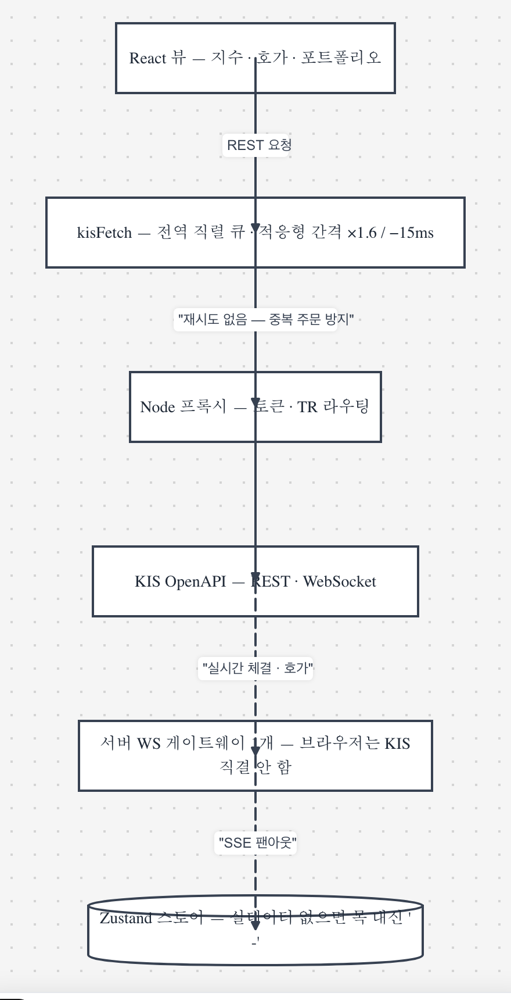

# PULSE FE 아키텍처 — RADIO

> R(Requirements) → A(Architecture) → D(Data model) → I(Interface) → O(Optimization & Observability).
> 원칙: "사용자가 어떤 결과물을 기대하는지 / 그 품질 기준은 무엇인지 / 품질을 보장하려면 어떤 구조가 필요한지"를 진행하는 거예요.

---

## R — Requirements (요구사항은 수치로)

**기능**: 시황 통합 터미널 — 지수·히트맵·뉴스(감성)·KR 실시간 체결/호가·순위(TOP100)·포트폴리오(KIS 모의계좌)·AI 종합의견·기술적 목표가.

**품질 기준 (도메인 지표 — "빠르다"를 수치로 표현했어요)**

| 지표 | 목표 | 현재 달성 수단 |
|---|---|---|
| time-to-first-tick (SSE 연결→첫 체결) | < 3s | 백엔드 게이트웨이 상시 연결 + onopen 일괄 재구독 |
| KR 시세 신선도 | 틱 단위(실시간) | KIS ws → SSE 팬아웃 |
| US 시세 신선도 p75 | ≤ 15s | 관심종목 15s 폴링 |
| 지수(티커·카드) 신선도 | ≤ 30s | 30s 폴링 (App.tsx) |
| 히트맵 신선도 | ≤ 60s | 60s 폴링 |
| 포트폴리오 평가액 | ≤ 30s | 30s 폴링 |
| 뉴스 | ≤ 1h | 3소스 배치(1h TTL) + 수동 갱신 |
| 연결 이상 인지 | ≤ 12s | 연결 토스트 → 12s 무응답 시 새로고침 유도 |

**Core Web Vitals 목표(p75)**: LCP < 2.5s · INP < 200ms · CLS < 0.1.
현재 CLS 방어는 카드별 스켈레톤(레이아웃 점프 0) · rAF 마퀴(transform-only) · SVG 차트 고정 높이로 하고 있어요.
⚠️ **갭**: 실측 장치가 없어요 — O장 관측성 로드맵 참조.

**실패 시 UX 계약(전면 동일룰)**: 실데이터 없으면 목이 아니라 **"-"** · 상태 배지("● 연결 끊김") · 재시도 버튼 · stale-while-error(서버 캐시가 직전 값 서빙)로 처리해요.

---

## A — Architecture (책임 분리와 데이터 흐름)

**실시간 경로 (Toss/Upbit식 게이트웨이)** — 브라우저는 KIS에 직결하지 않는다:

**상태 5분류 매핑** (아키텍처 = 상태의 주소를 결정해요)

| 분류 | PULSE 실체 | 보관 위치 |
|---|---|---|
| server state | 지수·히트맵·뉴스·AI·포트폴리오·리서치·전세 / SSE 체결·호가 | zustand / hook state(SSE) |
| local state | 탭, 기간·마켓·정렬 토글, 차트 줌·스크럽, 검색어 | 컴포넌트 useState |
| **URL state** | **없음 — 갭이에요.** selectedCode·tab이 URL에 없어서 새로고침/공유 시 대시보드로 리셋돼요 | 개선 후보: `?tab=detail&code=005930` |
| optimistic | 없음(주문 기능 부재 — 해당 없음) | — |
| derived | densify 차트 시리즈, 기술적 목표가(볼린저), 52주 범위, 도넛 비중, AI 종합점수(서버 파생) | useMemo / 서버 |

---

위 구조에서 **KIS 경계**만 떼어 이벤트 플로우로 그리면 이래요 — REST는
`kisFetch` 게이트 하나로, 실시간은 서버 WS 게이트웨이 하나로 수렴해요:

> 이 다이어그램은 [pig-ma](https://github.com/gook-lab/pig-ma)의 Mermaid
> import로 그렸어요. 원본 정의는
> [`diagrams/kis-data-flow.mmd`](diagrams/kis-data-flow.mmd).

## D — Data Model (전송·표현 비용까지 설계)

**단일 계약**: `src/data/types.ts`의 `MarketApi` — mock/http 구현이 같은 계약을 만족해요(strangler). 화면은 타입에만 의존하고 있어요.

**O(1) 표현 원칙 적용 사례** (likedUsers→viewerState 교훈에서 배웠어요):
- 뉴스 감성: 원문 대신 서버가 `sentiment: good|bad|neutral` **라벨 1개**로 축약 (AV 라벨 + 키워드 분류기)
- 포트폴리오: 보유 N건을 클라가 합산하지 않도록 서버가 `summary{totalValue,pnl,…}` **집계 전송**
- 순위: 서버 정렬 완료본(rank 포함) — 클라 정렬 O(0)
- AI 종합: 뉴스 60건·지수·F&G를 서버가 `score+markets[]`로 파생

**컬럼형 시계열 저장**(`server/realestate/index.mjs`): 월별 시계열을 중첩 배열 `[[가격, 건수], …]`로 두면 8,748단지 × 17개월 × 2종 = **297,432개의 작은 배열**이 각각 헤더를 달고 힙에 남더라고요(실측 21.6MB). 로드 시 `columnize()`가 `Float64Array`(가격) + `Uint16Array`(건수) 두 덩어리로 접어요 — 파일은 그대로 JSON이라 배치·캐시 형식은 그대로예요.
- 접근자: `seriesRows(store, c, kind)`(응답용 복원) · `seriesValueAt(store, c, kind, idx)`(거래 없는 달은 직전 유효값). `NaN` = 거래 없음(0과 구분돼요).
- **Float32는 안 돼요** — 유효숫자 7자리라 순위 행 평당가가 3,189 → 3,190으로 밀려요(실측). 정렬 기준값은 Float64예요.
- 상세에서만 쓰는 `recent`(최근 거래 10건)는 상주시키지 않고 요청 시 거래 샤드에서 만들어요.
- 효과: heap 82.0 → 51.4MB, 서버 RSS 143.8 → 48.6MB.

**정직성 필드 패턴**: `unavailable?: boolean`(실패≠0), `targetReal?: boolean`(실산출 목표가만 표시), `source: 'kis-mock'|'kis-real'`(출처 명시), `DetailHint`(임의 종목 코드-이름 불일치 방지)를 써요.

---

## I — Interface (컴포넌트 · 서버 API · 이벤트 · 관측)

**컴포넌트 계약** (`components/common` 배럴):
- 색 주입 규칙: 등락색은 컴포넌트가 정하면 안 돼요 — `signColor(pct, mode)`·`HOLD`·`STATUS_*` 주입하세요 (하드코딩 금지)
- `PriceChart{series,candles,volumes,labels,mode,dayChange…}` — 데이터만 받고 상호작용(스크럽·줌·미니맵)은 내부 소유로 가고 있어요
- `Badge{color}` / `Segmented{options,value,onChange}` / `ReasonList{sign,mode}` / `MarketChip{market}`을 쓰세요

**서버 API** (전체 cached TTL + in-flight dedup + stale-on-error):

| 경로 | TTL | 소스 |
|---|---|---|
| /api/stream (SSE) + /api/stream/bye | 실시간 | KIS ws 게이트웨이 |
| /api/kr/quotes · us/quotes | 15s | KIS · Finnhub |
| /api/kr/indices | 20s | KIS 지수 |
| /api/kr/rank | 30s | KIS 순위(30건 캡) |
| /api/kr/top100 | 60s | 다음 금융(실시장) |
| /api/kr/chart-all · targets | 5m | KIS 일/주/월봉 (+볼린저) |
| /api/indices/us · fx · macro · econ | 30s~1h | Finnhub·ECOS·FRED |
| /api/news (+refresh) | 1h | AV+Finnhub+CNN(구글뉴스) 병합 60건 |
| /api/portfolio | 15s | KIS 잔고(VTTC8434R) |

**SSE 이벤트**: `hello{id}` · `state{connected|connecting|disconnected}` · `trade` · `orderbook` (파서 필드 인덱스는 골든 픽스처 테스트로 잠금).

**브라우저 이벤트**: ⌘K 검색 · `pagehide→sendBeacon`(이탈 보장 전송) · `document.hidden` 게이트(모든 폴링 차단) · 휠/핀치/드래그(차트)로 상호작용해요.

**관측 인터페이스**: ⚠️ **갭** — 텔레메트리가 없어요. O장 로드맵 참조.

---

## O — Optimization & Observability

**렌더 비용 계산** (가상화 판단 근거):

| 뷰 | 계산 | 판단 |
|---|---|---|
| TOP100 리스트 | 100행 × ~8노드 = 800노드 | 가상화 불필요(스크롤 컨테이너로 충분) |
| 히트맵 | 57타일 + 라벨 ≈ 200노드 | 문제없음 |
| 차트 | 264pt여도 **path 1개**(SVG polyline) | DOM 폭발 없음 |
| 체결 내역 | slice(0,30) 캡 | 무한 성장 방지 |

**적용된 최적화**: rAF 마퀴(transform-only, 환경설정 면역) · densify 결정적 시드(리렌더 안정) · SSE reopen 100ms 디바운스 · 서버 in-flight dedup(StrictMode 이중호출 흡수) · 빈 결과 캐시 금지(스로틀 박제 방지) · 가격 변경 플래시(GPU backgroundColor) · 폴링 visibility 게이트로 처리했어요.

**관측성 로드맵 (아직 구현 전 — 다음 스텝)**:
1. `web-vitals` 라이브러리로 LCP/INP/CLS p75 수집 → **이번에 깐 sendBeacon 채널 재활용해요** (`/api/telemetry` 비컨)
2. 도메인 지표: time-to-first-tick, SSE 재접속 횟수/세션, "-" 노출 비율(데이터 가용성 SLI) 수집
3. 에러: window.onerror + unhandledrejection → 비컨으로 보낼 예정이에요

---

## 부록 — 이 구조가 지키는 불변식
1. 브라우저는 KIS에 직결하지 않아요(키·연결수·재접속은 서버 책임)
2. 실데이터가 없으면 목이 아니라 "-"예요
3. 등락색은 주입돼요(colorMode 반전 일관성 유지)
4. 파서 계약은 골든 테스트로 잠가요(실계좌 전환 시 픽스처 갱신)
5. 캐시는 빈 성공을 저장하면 안 돼요
