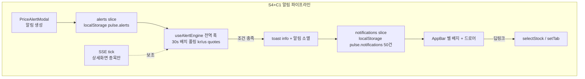
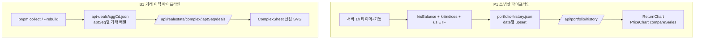

# PULSE 기능 확장 1차 웨이브 (S1·D1·P1·S4+C1·B1) - Plan

## Goal Capsule

- **목표:** `handoff/FEATURE-PROMPTS.md` 22건 중 우선순위 5건 — S1 모의 주문 티켓, D1 실시간 랭킹, P1 수익률 vs 벤치마크, S4 가격 알림 + C1 알림 센터(묶음), B1 단지 상세 시트 — 를 `refactor/FeatureExpansion.dc.html` 시안 기준으로 구현한다.
- **작업 순서:** U1(공통 기반) → S1 → D1 → P1 → S4+C1 → B1. 사용자 지정 순서.
- **권위 순서:** 이 플랜 > FeatureExpansion 시안 > FEATURE-PROMPTS.md 프롬프트 원문. 단, `CLAUDE.md` 컨벤션(등락색 signColor 주입 · 실패 시 목 폴백 금지 → unavailable · 공통 컴포넌트 우선)은 항상 최우선.
- **중단 조건:** KIS 모의계좌 rate limit로 신규 폴링이 기존 화면을 깨뜨릴 때, `pnpm collect` 배치 스키마 변경이 기존 스크리너를 깨뜨릴 때 — 진행을 멈추고 보고한다.
- **실행 프로필:** 로컬 검증 = `pnpm test` + `pnpm build` + `pnpm dev`/`pnpm server` 실기동. QA는 gstack `$B`(browse).

---

## Product Contract

### Summary

FEATURE-PROMPTS의 1차 웨이브 5개 기능을 기존 아키텍처(zustand `useStore` · `httpApi` strangler · `src/components/common` · SSE 실시간 게이트웨이) 위에 얹는다. handoff/common 컴포넌트는 도입하지 않고 기존 common을 확장하며(Sparkline 이식 + PriceChart 비교 시리즈), 신규 데이터는 백엔드 라우트+캐시를 거치고 실패 시 unavailable로 표시한다.

### Problem Frame

대시보드~부동산 6개 탭의 골격은 완성됐지만 "보기만 하는" 화면이다. 주문·랭킹·수익률 추적·알림·단지 상세라는 행동 유도 기능이 없어 Toss/KB류 앱 대비 체감 완성도가 낮다. 시안과 프롬프트는 준비돼 있으나 프롬프트에 없는 기획 정책(호가단위, 예수금 소스, 랭킹 소스, 수익률 이력, 알림 평가 위치, KB시세, 기존 모달과의 관계)이 미확정이었고, 이번 계획에서 전부 확정했다.

### Requirements

**S1 모의 주문 티켓 (종목상세)**

- R1. KR 종목에서 매수/매도 × 지정가/시장가 모의 주문을 넣을 수 있다. US 종목은 미지원 안내를 표시한다(호가·수수료 체계 상이).
- R2. 예수금·보유수량은 KIS 모의계좌 포트폴리오(`portfolio.cash`, `holdings`)에 로컬 페이퍼 주문의 누적 효과를 겹쳐 계산한다.
- R3. 지정가는 KRX 가격대별 호가단위로 스냅되고, 호가창 가격 클릭 시 지정가에 채워진다.
- R4. 예상 체결금액 · 수수료(0.015%) · 주문 후 예수금/보유가 입력과 동시에 재계산된다(mono 표기).
- R5. 주문 버튼 → 확인 Modal(종목·수량·가격 요약) → 확정 시 toast 성공 알림, 주문은 localStorage `pulse.paper-orders`에 영속되고 포트폴리오 탭에서 조회된다.
- R6. 시장가 주문의 기록가는 최우선 호가(매수=최우선 매도호가, 매도=최우선 매수호가), 호가 부재 시 최근 체결가/현재가.
- R7. 매도 수량이 계산상 보유수량(R2)을 초과하면 확정 전에 인라인 에러로 막는다. 10%/25%/50%/최대 칩은 이 보유·예수금 기준으로 계산한다.

**D1 실시간 랭킹 (대시보드)**

- R8. 급상승 / 급하락 / 거래량 / 거래대금 4개 탭을 Segmented로 전환한다(시안의 '인기'는 데이터 소스가 없어 '거래대금'으로 대체).
- R9. 1차는 KR 전용. 시장 토글의 US/전체는 "준비 중" 비활성 표시.
- R10. 15초 폴링, 문서 비가시성(`document.hidden`) 시 폴링 중단, stale-while-revalidate로 이전 목록 유지.
- R11. 행 클릭 → `selectStock(code)` → 종목상세 탭 이동.
- R12. 순위 변동 시 framer-motion layout으로 행 재정렬, 신규 진입 행은 배경 플래시 1회.

**P1 수익률 추이 vs 벤치마크 (포트폴리오)**

- R13. 백엔드가 KST 기준 하루 1엔트리로 포트폴리오 평가액 스냅샷을 적재한다(당일 값 upsert, 서버 재시작에도 파일 유지). KOSPI·S&P500 종가도 같은 엔트리에 기록한다.
- R14. 포트폴리오 상단 ReturnChart 카드: 내 수익률(%) 라인 + KOSPI/S&P500 벤치마크 2라인 오버레이. 정규화 기준은 조회 구간 첫 스냅샷(=0%).
- R15. 스크럽 시 세 라인의 날짜·값이 툴팁에 함께 표시된다.
- R16. 기간 Segmented(1개월/3개월/1년/전체). 스냅샷 2개 미만이면 "수익률 이력 수집 중" EmptyState(과거 백필 불가 — 적재 시작 시점부터 쌓임).

**S4 가격 알림 (종목상세 → 전역)**

- R17. 종목상세 헤더 종 아이콘 → PriceAlertModal. 조건: 목표가 도달(이상/이하), 등락률 ±N%(1~30), 52주 신고가 갱신. 저장은 localStorage `pulse.alerts`.
- R18. 알림 평가는 현재 탭과 무관하게 전역에서 돈다. 충족 시 toast info + 알림센터 기록 후 해당 알림은 1회성으로 소멸한다.
- R19. 같은 조건이 세션 내 중복 발화하지 않는다(발화 즉시 소멸이 방지 수단).
- R20. 활성 알림이 있는 종목은 관심종목 리스트에 작은 종 아이콘을 표시한다.

**C1 알림 센터 (AppBar)**

- R21. AppBar 벨 아이콘 + 미읽음 카운트 배지.
- R22. 드로어: 알림을 시간순으로, 신규 표시(점·배경), 항목 클릭 시 읽음 처리, "모두 읽음" 버튼.
- R23. kind별 딥링크 — price → 해당 종목상세(`selectStock`), apt → 부동산 탭, sys → 이동 없음.
- R24. localStorage `pulse.notifications`에 최근 50건 영속.

**B1 단지 상세 시트 (부동산)**

- R25. 단지 선택 시 1440px 이상에서는 3열째 컬럼 시트, 미만에서는 Modal. 기존 ComplexDetail 모달을 이 형태로 개편한다(병존 아님).
- R26. 실거래 산점 차트(전용 경량 SVG): 보유 기간(현재 배치 17개월, 최대 24개월)의 개별 거래를 점으로, 저층(1~5층)/중·고층 색 구분, 3개월 이동 중앙값 라인 오버레이. 현재 데이터는 전월세 기준.
- R27. 평형(면적대) Segmented 전환이 산점·중앙값·시그널에 모두 반영된다.
- R28. 매매 실거래(활용신청 대기)와 KB시세는 unavailable("-"·안내 문구) 처리한다. 근사치 생성 금지.
- R29. 대출 계산기 접이식 섹션: 보증금/매매가 자동 채움, LTV 칩(40/50/60/70%), 금리 입력, 기간 → 최대 대출액·월 상환액(원리금균등)·총 이자. "단순 계산, 실제 한도는 심사에 따름" 캡션 필수.
- R30. 관심 ★는 기존 `aptWatchlist`(`toggleAptWatch`)와 연동한다.

### Scope Boundaries

**Deferred to Follow-Up Work**

- FEATURE-PROMPTS 나머지 17건(D2~D4, S2~S3, N1~N3, P2~P3, R1~R3리서치, B2~B3, C2).
- D1 US 랭킹 소스 연동(소스 선정 필요), 랭킹 행 미니 스파크라인(KIS 분봉 rate limit — KTD5) 및 Sparkline 컴포넌트 이식(handoff `Chart.tsx` — 스파크라인 착수 시 함께).
- B1 매매 실거래 산점(국토부 매매 API 활용신청 승인 후 `--with-trade` 수집분으로 확장), KB시세 실데이터 연동.
- 알림의 브라우저 푸시/백그라운드 알림(현재는 앱 열려 있을 때만 평가).

**Outside this product's identity**

- 실제 주문 체결(모의 기록만), 규제 반영 대출 심사, 계정/서버 사이드 사용자 데이터 저장(개인용 로컬 도구).

---

## Planning Contract

### Key Technical Decisions

- KTD1. **handoff/common 미도입 — 기존 `src/components/common` 확장.** (session-settled: user-approved — chosen over handoff 전면 교체: src PriceChart가 null 처리·provisionalFrom·liveBadge 등 상위 버전이고 Toast·소켓도 기존이 우세) Toast는 기존 `src/lib/toast.tsx`(react-hot-toast) 유지. handoff `Chart.tsx`의 Sparkline은 이번 웨이브에 소비처가 없어(KTD5) 이식하지 않고, 스파크라인 착수 시 이식한다.
- KTD2. **S1 잔고 소스 = KIS 모의계좌 + 페이퍼 오버레이.** (session-settled: user-approved — chosen over 시안의 독립 가상잔고 500만원: 이미 연동된 계좌 자산과 이어져야 포트폴리오 탭 조회가 의미 있음) 유효 예수금 = `portfolio.cash` − 페이퍼 매수 합 + 페이퍼 매도 합. 유효 보유 = `holdings` 수량 ± 페이퍼 체결 수량. `portfolio.unavailable`이면 주문 버튼 비활성 + 안내.
- KTD3. **KRX 가격대별 호가단위 테이블 적용.** (session-settled: user-approved — chosen over 시안의 100원 고정: 실제 호가 스냅이 맞음) 2023-01 개편 기준 7단계(2천원 미만 1원 ~ 50만원 이상 1,000원)를 `src/lib/krxTick.ts`로 분리하고 단위 테스트로 고정.
- KTD4. **D1은 기존 `/api/kr/rank` 재사용, 신규 라우트 없음.** by=up|down|volume|amount 매핑이 4개 탭과 1:1. KIS 순위는 30건 하드캡이므로 limit=10으로 요청. US 비활성은 session-settled(user-approved).
- KTD5. **랭킹 스파크라인 1차 제외.** 행당 분봉 조회(10콜/15초)는 KIS 모의계좌 rate limit을 위협 — 등락률 배지로 대체하고 Deferred로 이관.
- KTD6. **P1 스냅샷은 서버 파일 적재, 벤치마크 동시 기록.** (session-settled: user-approved — 적재 시작 방식, chosen over 과거 이력 외부 조회: KIS에 과거 잔고 API 없음) `server/cache/portfolio-history.json`에 `{date, totalValue, principal, kospi, spx}` 하루 1엔트리 upsert. 벤치마크 종가를 같은 엔트리에 넣어 외부 히스토리 API 없이 라인 길이를 일치시킨다. 적재 트리거는 서버 내 1시간 간격 타이머(+기동 시 1회) — 당일 값을 덮어써 장 마감 후 마지막 값이 그날의 확정값이 된다. 주말·휴장일도 엔트리는 쌓이되 값이 평일과 동일하므로 차트상 평탄 구간으로 자연 처리.
- KTD7. **알림 평가는 전역 30초 시세 폴링 기반.** SSE tick 기반 평가는 알림 종목만큼 구독을 늘려 구독 예산(세션당 등록 한도)을 위협한다. 전역 훅이 alerts의 종목을 모아 KR은 `/api/kr/quotes`, US는 `/api/us/quotes` 배치 폴링으로 평가하고, 종목상세에 열려 있는 종목만 tick이 보조한다. 52주 신고가 기준값은 알림 생성 시점의 상세 데이터(주봉 52주 최고가)로 고정 저장.
- KTD8. **B1은 기존 ComplexDetail을 개편(대체).** (session-settled: user-approved — chosen over 병존 신설: 동일 데이터·동일 진입점의 중복 화면 방지) 기존 시그널 그리드·최근 거래 테이블은 시트 안으로 흡수.
- KTD9. **B1 거래 이력은 collect 배치가 구(sggCd) 샤드 JSON으로 보존.** 단일 파일은 서울 전역 거래로 수십 MB가 되므로 `server/cache/apt-deals/{sggCd}.json`(단지 aptSeq 키 → 거래 배열)로 샤딩. `/api/realestate/complex/:aptSeq/deals`가 해당 샤드만 읽어 응답(캐시 필수). `pnpm collect --rebuild`가 시그널과 함께 재생성.
- KTD10. **KB시세 섹션은 unavailable 처리.** (session-settled: user-approved — chosen over 시안의 `중앙값×1.04` 근사 재현: 목 폴백 금지 규약 위반)
- KTD11. **클라이언트 영속은 localStorage 일원화 + 상한.** `pulse.paper-orders` / `pulse.alerts` / `pulse.notifications` 모두 기존 `readJson`/`writeJson` 패턴(useStore.ts)을 따른다. 서버 저장 없음. 상한: paperOrders 100건 · alerts 50건 · notifications 50건 — 초과 시 오래된 항목부터 제거. `writeJson` 실패(용량 초과 등)는 조용히 삼키지 않고 toast 경고 1회.
- KTD12. **시안 하드코딩 색은 전부 토큰·signColor로 치환.** 시안의 `#F6465D`/`#4C82FB`/`#7C6CFF` 등은 각각 `signColor(±1, colorMode)`와 CSS 변수(`--brand` 등)로 매핑. 새 색상 하드코딩 금지.
- KTD13. **신규 카드 공통 상태 규칙.** 모든 신규 카드·패널은 4상태를 갖는다 — 첫 로딩 = `CardSkeleton`/`SkeletonRows`, 실패 = `ErrorState`+재시도, 데이터 없음 = `EmptyState`(카드별 문구), 소스 불가(`portfolio.unavailable` 등) = `ErrorState`(재시도=해당 소스 리로드). 폴링 갱신 중에는 기존 데이터를 유지하고 로딩 UI를 띄우지 않는다(stale-while-revalidate). 각 유닛에 반복 명시하지 않으며 이 규칙이 기본값이다.

### High-Level Technical Design

알림 파이프라인(S4→C1)과 신규 데이터 파이프라인(P1·B1)이 이 계획의 구조적 축이다.

### Sequencing

U1 → (U2→U3) → U4 → (U5→U6) → (U7→U8) → (U9→U10). 각 괄호 묶음이 기능 단위 완결이며, 사용자 지정 순서(S1→D1→P1→S4+C1→B1)를 따른다. U8은 U7이 만드는 notifications slice에 의존하므로, U7에서 slice를 먼저 만들고 U8이 UI를 얹는다.

---

## Implementation Units

| U-ID | 제목 | 주요 파일 | 의존 |
|---|---|---|---|
| U1 | 공통 기반: PriceChart compareSeries | src/components/common/PriceChart.tsx | — |
| U2 | S1 주문 도메인: krxTick + paperOrders | src/lib/krxTick.ts, src/store/useStore.ts | — |
| U3 | S1 UI: OrderTicket + 호가 연동 + 포트폴리오 내역 | src/components/detail/OrderTicket.tsx | U2 |
| U4 | D1 RankingBoard | src/components/dashboard/RankingBoard.tsx | — |
| U5 | P1 백엔드: 스냅샷 적재 + history API | server/portfolioHistory.mjs, server/index.mjs | — |
| U6 | P1 프론트: ReturnChart | src/components/portfolio/ReturnChart.tsx | U1, U5 |
| U7 | S4 알림 도메인 + PriceAlertModal | src/lib/alertEngine.ts, src/components/detail/PriceAlertModal.tsx | — |
| U8 | C1 알림센터 드로어 + 벨 | src/components/NotificationCenter.tsx, AppBar.tsx | U7 |
| U9 | B1 백엔드: deals 샤드 + API | server/realestate/collect.mjs, index.mjs | — |
| U10 | B1 프론트: ComplexSheet 개편 | src/components/realestate/ComplexDetail.tsx | U9 |

### U1. 공통 기반 — PriceChart compareSeries 확장

- **Goal:** P1·후속 기능이 쓸 비교 라인을 PriceChart에 확보한다.
- **Requirements:** R14, R15 (기반)
- **Dependencies:** 없음
- **Files:** `src/components/common/PriceChart.tsx`, `src/components/common/index.ts`, `src/components/common/__tests__/compareSeries.test.ts`(신규)
- **Approach:**
  1. PriceChart에 `compareSeries?: { name: string; data: (number|null)[]; color: string }[]` prop 추가. 메인 시리즈와 같은 X축을 공유하고, min/max 계산에 포함하며, 스크럽 툴팁에 이름·값을 함께 표시(특정 지점이 null인 시리즈는 툴팁 행을 유지하되 값은 "-").
  2. 비교 라인은 캔들/거래량/미니맵 등 기존 기능과 독립 — compareSeries 미지정 시 렌더 경로가 기존과 동일해야 한다(회귀 0).
- **Patterns to follow:** 기존 PriceChart의 null 끊어 그리기(`(number|null)[]`), `signColor` 주입 방식.
- **Test scenarios:**
  - compareSeries 2개 주입 시 min/max가 전체 시리즈 기준으로 계산된다.
  - compareSeries에 null 구간이 있으면 해당 구간 라인이 끊긴다.
  - compareSeries 미지정 시 스냅샷(주요 SVG path 수)이 기존과 동일하다.
- **Verification:** `pnpm test` 통과 + 기존 종목상세 차트 화면 회귀 없음(실기동 확인).

### U2. S1 주문 도메인 — krxTick 유틸 + paperOrders 스토어

- **Goal:** 주문 UI가 쓸 순수 로직(호가단위·검증·잔고 오버레이)과 영속 스토어를 만든다.
- **Requirements:** R2, R3, R6, R7 · KTD2, KTD3, KTD11
- **Dependencies:** 없음
- **Files:** `src/lib/krxTick.ts`(신규), `src/lib/krxTick.test.ts`(신규), `src/lib/paperOrders.ts`(신규 — 검증·잔고 계산 순수 함수), `src/lib/paperOrders.test.ts`(신규), `src/store/useStore.ts`, `src/data/types.ts`
- **Approach:**
  1. `krxTick.ts`: 가격→호가단위, `snapToTick(price, dir)` 제공(KTD3 테이블).
  2. `types.ts`에 `PaperOrder { id, code, name, market, side, type, price, qty, fee, at }` 추가.
  3. `useStore`에 `paperOrders` slice + `placePaperOrder` 액션. 저장은 `pulse.paper-orders`(readJson/writeJson 패턴).
  4. `paperOrders.ts` 순수 함수: 유효 예수금/보유 계산(KTD2 오버레이), 매도 초과 검증 `validateSell()`(R7 — U3가 수량 onChange와 확정 클릭 두 지점에서 같은 함수를 호출해 검증 일관성 보장), 수수료 0.015% 계산, %칩 수량 계산.
  5. `marketOrderPrice(side, orderbook, lastTrade, current)` 순수 함수: 매수=최우선 매도호가 → 최근 체결가 → 현재가 3단계 폴백(매도는 최우선 매수호가부터) — R6의 단일 구현처.
  6. paperOrders 100건 상한(KTD11) — 초과 시 오래된 주문 제거.
- **Test scenarios:**
  - 호가단위: 1,999→1원 / 2,000→5원 / 499,500→500원 / 500,000→1,000원 등 경계값 7단계 전부.
  - snapToTick: 81,234원 매수 지정가 → 단위로 내림 스냅.
  - 유효 잔고: 예수금 500만 + 매수 2건 후 매도 1건 → 오버레이 합산 정확.
  - 매도 검증: KIS 보유 10주 + 페이퍼 매수 5주 → 16주 매도 시도 시 거부.
  - 예수금 부족 매수 거부, `portfolio.unavailable` 시 주문 불가 상태 반환.
  - marketOrderPrice: 호가 있음 / 호가 없고 체결가 있음 / 둘 다 없음 3단계 폴백.
  - 101번째 주문 저장 시 가장 오래된 주문이 제거된다.
- **Verification:** `pnpm test` 통과.

### U3. S1 UI — OrderTicket + 호가 클릭 연동 + 포트폴리오 주문 내역

- **Goal:** 시안의 주문 티켓 UX를 종목상세 우측 컬럼에 구현하고 포트폴리오 탭에서 내역을 조회한다.
- **Requirements:** R1, R3~R7
- **Dependencies:** U2
- **Files:** `src/components/detail/OrderTicket.tsx`(신규), `src/components/detail/StockDetail.tsx`(우측 컬럼 배치 + Orderbook `onPickPrice` prop), `src/components/portfolio/Portfolio.tsx`(모의 주문 내역 섹션)
- **Approach:**
  1. Segmented 매수/매도(색은 `signColor(±1, mode)`) · 지정가/시장가, 수량 스테퍼 + %칩, 지정가 입력은 blur/스테퍼 시 `snapToTick`.
  2. Orderbook에 `onPickPrice?: (price: number) => void` 추가, 행 클릭 시 지정가 채움 + 지정가 모드 전환.
  3. 확인은 기존 `Modal`/`ConfirmDialog`, 성공 시 `toast.success`. US 종목이면 티켓 대신 EmptyState("모의 주문은 KR 종목만 지원").
  4. 시장가 기록가는 U2의 `marketOrderPrice()` 호출(R6) — UI에서 폴백 로직을 중복 구현하지 않는다.
  5. Portfolio 탭 하단에 주문 내역 테이블(시간·매매 Badge·종목·수량·가격), 빈 상태 EmptyState.
- **Patterns to follow:** StockDetail 기존 3열 grid, 공통 컴포넌트 표(CLAUDE.md), 시안 `FeatureExpansion.dc.html` S1 레이아웃(3단: 호가 300px + 폼 360px + 내역).
- **Test scenarios:**
  - Test expectation: UI 유닛테스트 없음 — 로직은 U2에서 검증, UI는 실기동 QA로 확인 (호가 클릭→지정가 채움, %칩 수량, 확인 모달→토스트→내역 반영, US 종목 안내, 색상 모드 전환 시 매수/매도 색 반전).
- **Verification:** `pnpm dev`+`pnpm server` 실기동에서 위 QA 시나리오 통과, `pnpm build` 통과.

### U4. D1 RankingBoard

- **Goal:** 대시보드에 실시간 급등락/거래 랭킹 카드를 추가한다.
- **Requirements:** R8~R12 · KTD4, KTD5
- **Dependencies:** 없음
- **Files:** `src/components/dashboard/RankingBoard.tsx`(신규), `src/components/dashboard/Dashboard.tsx`, `src/data/httpApi.ts`·`src/data/types.ts`(`getRanking` 계약 추가), `src/data/mockApi.ts`(백엔드 다운 시 unavailable 반환)
- **Approach:**
  1. `httpApi.getRanking(kind)` → `/api/kr/rank?by={up|down|volume|amount}&limit=10`. 실패 시 unavailable 플래그(목 생성 금지).
  2. 15초 폴링 + `document.hidden` 중단(R10), stale-while-revalidate은 기존 `cached()`/aptScreen 패턴 재사용.
  3. 행: 순위(1~3 강조) · MarketChip · 종목명/코드 · 현재가 · 등락률(`signColor`). 스파크라인 없음(KTD5).
  4. `motion.div layout`으로 재정렬, 신규 진입 코드엔 배경 플래시 1회(이전 목록 대비 diff).
  5. 행 클릭 `selectStock(code)`. US/전체 토글은 disabled + "준비 중" 툴팁(R9).
- **Test scenarios:**
  - Test expectation: 데이터 변환 로직이 얇아 유닛테스트 없음 — 폴링 중단·재정렬은 실기동 QA (탭 전환 시 15초 폴링 정지 확인, 랭킹 탭 4종 전환, 행 클릭 딥링크, 백엔드 중단 시 ErrorState+재시도).
- **Verification:** 실기동에서 4개 탭 데이터 표시·재정렬 애니메이션·딥링크 확인, `pnpm build` 통과.

### U5. P1 백엔드 — 포트폴리오 스냅샷 적재 + history API

- **Goal:** 일별 포트폴리오·벤치마크 이력을 서버에 쌓고 조회 API를 연다.
- **Requirements:** R13 · KTD6
- **Dependencies:** 없음
- **Files:** `server/portfolioHistory.mjs`(신규), `server/portfolioHistory.test.mjs`(신규), `server/index.mjs`(타이머 기동 + `/api/portfolio/history` 라우트)
- **Approach:**
  1. `portfolioHistory.mjs`: `record()` — kisBalance·KR 지수·US ETF(S&P500 프록시 SPY) 현재값을 읽어 `server/cache/portfolio-history.json`에 `{date(KST), totalValue, principal, kospi, spx}` upsert. 읽기 실패 항목은 해당 필드 null(부분 기록 허용).
  2. 서버 기동 시 1회 + 1시간 간격 setInterval. 타이머 ID를 보관하고 정리 함수(`stop()`)를 제공한다 — SSE keepalive의 `clearInterval` 정리 패턴과 동일. 파일 쓰기는 tmp→rename(realestate 패턴).
  3. `/api/portfolio/history?days=N` — 최근 N일 배열 반환, `cached()` 60초.
- **Patterns to follow:** `server/realestate/index.mjs`의 tmp→rename 원자 쓰기, `cached()` 라우트 패턴.
- **Test scenarios:**
  - 같은 날짜 2회 record → 엔트리 1개, 값은 마지막 것.
  - 날짜 넘어가면 새 엔트리 추가.
  - kisBalance 실패 시 totalValue null로 기록되고 throw하지 않는다.
  - days=7 요청 시 최근 7일만 반환.
- **Verification:** `pnpm test` 통과(vitest가 서버 `*.test.mjs`도 수집), 서버 기동 후 파일 생성 확인.

### U6. P1 프론트 — ReturnChart

- **Goal:** 포트폴리오 상단에 수익률 vs 벤치마크 비교 차트를 붙인다.
- **Requirements:** R14~R16
- **Dependencies:** U1, U5
- **Files:** `src/components/portfolio/ReturnChart.tsx`(신규), `src/components/portfolio/Portfolio.tsx`, `src/data/httpApi.ts`·`types.ts`(`getPortfolioHistory`), `src/lib/returns.ts`(신규 — 정규화 순수 함수), `src/lib/returns.test.ts`(신규)
- **Approach:**
  1. `returns.ts`: 스냅샷 배열 → 첫 값 기준 수익률(%) 3시리즈 변환(내 계좌는 totalValue/principal 반영, null 필드는 라인 끊김).
  2. ReturnChart는 PriceChart + compareSeries(U1)로 렌더. 내 계좌 = brand 색, KOSPI/S&P500은 토큰 보조색. 헤더에 기간 수익률과 벤치마크 대비 초과수익 ±%p.
  3. 기간 Segmented(1개월/3개월/1년/전체) → `days` 파라미터. 스냅샷 2개 미만 시 EmptyState(R16), desc에 "수집 시작: YYYY-MM-DD"(history 첫 엔트리 날짜)를 표기해 이력이 짧은 이유를 설명한다. 서버 미기동 기간의 결측일은 라인 끊김으로 자연 표기.
- **Test scenarios:**
  - 정규화: [100, 110, 121] → [0, +10, +21]%.
  - 첫 값이 null인 시리즈는 첫 유효값 기준으로 정규화.
  - 중간 null → 해당 지점 값 null 유지(라인 끊김).
  - 초과수익 계산: 내 +12.5% vs KOSPI +1.8% → +10.7%p.
- **Verification:** `pnpm test` 통과 + 실기동에서 스냅샷 2개 이상 쌓인 상태 시뮬레이션(파일 시드)으로 3라인·스크럽 확인.

### U7. S4 알림 도메인 + PriceAlertModal

- **Goal:** 알림 CRUD와 전역 평가 엔진, 알림 생성 UI를 만든다.
- **Requirements:** R17~R20 · KTD7, KTD11
- **Dependencies:** 없음 (notifications slice를 이 유닛에서 함께 생성)
- **Files:** `src/lib/alertEngine.ts`(신규 — 조건 평가 순수 함수), `src/lib/alertEngine.test.ts`(신규), `src/store/useStore.ts`(alerts·notifications slice), `src/data/types.ts`(`PriceAlert`, `AppNotification`), `src/lib/useAlertEngine.ts`(신규 — 전역 훅), `src/App.tsx`(훅 마운트), `src/components/detail/PriceAlertModal.tsx`(신규), `src/components/detail/StockDetail.tsx`(헤더 종 아이콘), `src/components/dashboard/Watchlist.tsx`(활성 알림 종 표시)
- **Approach:**
  1. `PriceAlert { id, code, name, market, kind: 'target-above'|'target-below'|'move-pct'|'high52', value, baseline?, createdAt }`. high52는 생성 시점 52주 최고가를 `baseline`으로 고정(KTD7).
  2. `alertEngine.ts` 순수 함수: `evaluate(alert, quote) → fired: boolean`. 발화 판정만 담당.
  3. `useAlertEngine`: App 레벨 마운트. 30초 간격으로 alerts의 KR 코드는 `/api/kr/quotes`, US 심볼은 `/api/us/quotes` 배치 조회 → evaluate → 발화 시 `toast`, notifications push, 알림 제거(R18·R19). 종목상세에 열린 코드는 tick 값도 evaluate에 공급(보조).
  4. notifications slice: `AppNotification { id, kind: 'price'|'apt'|'sys', title, desc, code?, at, read }`, 50건 초과 시 오래된 것 제거, `pulse.notifications` 영속.
  5. PriceAlertModal: 조건 3종 입력(등락률은 1~30 슬라이더/입력), 활성 알림 목록·삭제. Watchlist 행에 활성 알림 종 아이콘(R20).
- **Test scenarios:**
  - target-above: 목표 10,000 · 현재 10,001 → 발화, 9,999 → 미발화(경계 포함 규칙 명시: 이상/이하).
  - move-pct: 기준 ±N% 도달 시 발화(양방향 아님 — 설정 부호 따름).
  - high52: baseline 갱신 시 1회 발화.
  - 발화 후 알림이 목록에서 제거된다(중복 발화 불가 구조 검증).
  - notifications 50건 초과 시 가장 오래된 항목 제거. alerts 50건 상한(KTD11) 초과 생성 거부 + 안내.
- **Verification:** `pnpm test` 통과 + 실기동에서 목표가를 현재가 바로 아래로 설정→30초 내 toast·알림센터 기록 확인.

### U8. C1 알림센터 — AppBar 벨 + 드로어

- **Goal:** 알림 소비 UI(벨·드로어·딥링크)를 완성한다.
- **Requirements:** R21~R24
- **Dependencies:** U7
- **Files:** `src/components/NotificationCenter.tsx`(신규), `src/components/AppBar.tsx`
- **Approach:**
  1. AppBar 우측에 벨 버튼 + 미읽음 배지(개수, 9+ 표기). 클릭 시 우측 고정 드로어(360px, framer-motion 슬라이드, 백드롭 클릭 닫기, `useModalOpenSignal` 연동).
  2. 항목: kind별 아이콘, 제목·설명·상대시간, 신규 점. 클릭 → read 처리 + 딥링크(R23: price는 `selectStock(code)`, apt는 `setTab('realestate')`).
  3. "모두 읽음" 버튼, 빈 상태 EmptyState.
- **Patterns to follow:** 시안 C1 드로어 스펙(레이아웃·간격), Modal의 오버레이/ESC 관례.
- **Test scenarios:**
  - Test expectation: 상태 로직은 U7에서 검증 — UI는 실기동 QA (미읽음 배지 수, 클릭 시 읽음+딥링크, 모두 읽음, 새로고침 후 영속 확인).
- **Verification:** 실기동 QA 통과, `pnpm build` 통과.

### U9. B1 백엔드 — 거래 이력 샤드 + deals API

- **Goal:** 단지별 개별 거래 이력을 배치가 보존하고 API로 노출한다.
- **Requirements:** R26 (데이터), R28 · KTD9
- **Dependencies:** 없음
- **Files:** `server/realestate/collect.mjs`, `server/realestate/signals.mjs`, `server/realestate/deals.mjs`(신규 — 샤드 쓰기/읽기), `server/realestate/deals.test.mjs`(신규), `server/realestate/index.mjs`(`/api/realestate/complex/:aptSeq/deals` 라우트)
- **Approach:**
  1. collect 파이프라인이 이미 확보한 원시 거래 rows를 `server/cache/apt-deals/{sggCd}.json`(aptSeq → `{ym, day, kind, area, floor, price, monthlyRent}[]`)로 저장. tmp→rename 원자 쓰기. `--rebuild` 시에도 재생성.
  2. deals API: aptSeq → sggCd 매핑은 메모리 상주 complexes에서, 해당 샤드 lazy 로드 + LRU(구 단위 캐시, 최근 5개 구), 응답은 기간 내림차순.
  3. 매매(kind='trade') rows는 있으면 포함(활용신청 승인 후 자동 반영), 현재는 rent만.
- **Patterns to follow:** `server/realestate/index.mjs`의 부팅 상주·원자 쓰기, `cached()` 라우트.
- **Test scenarios:**
  - 샤드 쓰기: 두 구의 rows → 파일 2개, aptSeq 키 정확.
  - deals 조회: 존재하는 aptSeq → 내림차순 배열, 없는 aptSeq → 404 아닌 빈 배열 + unavailable 아님(거래 0건은 정상 상태).
  - 샤드 파일 부재 시(구버전 캐시) 빈 배열 + `stale: true` 류 표식으로 프론트가 "재수집 필요" 안내 가능.
- **Verification:** `pnpm test` 통과, `pnpm collect --rebuild` 후 샤드 생성 + API 응답 확인.

### U10. B1 프론트 — ComplexSheet 개편

- **Goal:** 기존 ComplexDetail 모달을 시안의 3열 시트로 개편하고 산점·평형·대출계산기를 붙인다.
- **Requirements:** R25~R30 · KTD8, KTD10
- **Dependencies:** U9
- **Files:** `src/components/realestate/ComplexDetail.tsx`(개편), `src/components/realestate/ComplexDetail.module.css`, `src/components/realestate/DealScatter.tsx`(신규 — 전용 경량 SVG), `src/components/realestate/LoanCalc.tsx`(신규), `src/lib/loan.ts`(신규 — 원리금균등 순수 함수), `src/lib/loan.test.ts`(신규), `src/components/realestate/RealEstate.tsx`(3열 배치), `src/data/httpApi.ts`·`types.ts`(`getComplexDeals`)
- **Approach:**
  1. 1440px 이상: RealEstate 3열째 컬럼으로 시트 렌더, 미만: 기존 Modal 유지(같은 내부 컴포넌트 공유) — R25. 선택 단지·평형·대출 입력 상태는 내부 컴포넌트 바깥(스토어 또는 부모 state)에 두어 리사이즈로 시트↔모달이 전환돼도 유지한다.
  2. DealScatter: X=계약일, Y=가격(전월세는 보증금 기준), 저층(floor 1~5)/중·고층 색 구분, 3개월 이동 중앙값 라인(점선), 평형 Segmented가 산점·라인·시그널 모두 필터(R27). PriceChart 확장 금지(프롬프트 명시) — 독립 SVG.
  3. 매매 탭/KB시세 비교 영역: 데이터 없으면 "-"와 안내("매매 데이터 활용신청 승인 대기" / "KB시세 미연동") — R28, KTD10. 근사치 생성 금지.
  4. LoanCalc: `loan.ts`의 원리금균등 공식, LTV 칩·금리 입력·기간, 면책 캡션(R29).
  5. 헤더 관심 ★은 `toggleAptWatch` 그대로(R30). 기존 시그널 그리드·최근 거래 테이블은 시트 하단에 흡수(KTD8).
- **Test scenarios:**
  - loan.ts: 3.6억·LTV 60%·연 3.8%·30년 → 월 상환액 검증(공식 대조값), 금리 0% 경계(단순 분할), 기간 1년 경계.
  - DealScatter 입력 변환: 거래 0건 평형 → EmptyState, 이상치 1건 포함 시 Y 스케일 방어(min=max 가드).
  - 평형 전환 시 중앙값 라인 재계산 검증(3개월 윈도 경계).
- **Verification:** `pnpm test` 통과 + 실기동에서 1440px 이상/미만 두 레이아웃, 평형 전환, 대출 계산, unavailable 표시 QA.

---

## Verification Contract

| 게이트 | 명령 | 적용 |
|---|---|---|
| 유닛테스트 | `pnpm test` (vitest — 프론트 `*.test.ts`와 서버 `*.test.mjs` 모두 수집) | U1, U2, U5, U6, U7, U9, U10 |
| 타입/빌드 | `pnpm build` | 전 유닛, 각 기능 묶음 완료 시 |
| 실기동 QA | `pnpm server` + `pnpm dev` 후 gstack `$B`(browse)로 기능별 시나리오 | U3, U4, U6, U8, U10 |
| 부동산 배치 | `pnpm collect --rebuild` 후 스크리너·시트 회귀 확인 | U9, U10 |

품질 게이트: 등락색·브랜드색 하드코딩 0건(`signColor`/토큰만), 데이터 실패 경로는 전부 unavailable/ErrorState(목 생성 0건), 서버 재기동은 `pnpm server:restart`만 사용.

---

## Definition of Done

- R1~R30이 구현되고 각 유닛의 Verification을 통과했다.
- `pnpm test`·서버 테스트·`pnpm build` 전부 녹색.
- 5개 기능이 실기동 QA에서 시안의 핵심 인터랙션(호가 클릭 채움, 랭킹 재정렬, 스크럽 3라인, 알림 발화→드로어, 평형 전환)을 재현한다.
- 기존 화면(대시보드·종목상세·포트폴리오·부동산 스크리너) 회귀 없음.
- 실험·폐기 코드가 diff에 남아 있지 않다.
- `기능명세.md`에 이번 웨이브의 확정 정책(KTD2·3·4·6·7·8·9·10·11·13)을 반영해 갱신한다.

---

## Open Questions

- (deferred) D1 US 랭킹 소스 — Finnhub 스크리너 vs 다른 소스. 후속 웨이브 착수 전 결정.
- (deferred) 랭킹 스파크라인 데이터 소스 — 분봉 배치 캐시 서버 측 구성 검토.
- (deferred) 매매 실거래 활용신청 승인 시점 — 승인 후 `--with-trade` 재수집으로 B1 산점에 매매 자동 포함.

---

## Sources & Research

- 시안: `refactor/FeatureExpansion.dc.html`(S1·D1·P1·B1·C1 탭, 정책 상수 포함 — 수수료 0.015%, 대출 3.8%/30년 예시), 프롬프트: `handoff/FEATURE-PROMPTS.md`.
- 기존 자산: `/api/kr/rank`(server/index.mjs — by=up|down|volume|amount, 30초 캐시), `cached()` stale-while-revalidate(src/data/httpApi.ts), localStorage 패턴(src/store/useStore.ts의 readJson/writeJson), SSE 게이트웨이(src/lib/kisSocket.ts).
- 데이터 제약 실측: `server/cache/apt-signals.json` — 단지 8,095개, 월 17개, recent 10건 캡, 매매 거래 0건(전월세만) → KTD9의 근거.
- 프로젝트 학습: KIS 순위 API 30건 하드캡·모의계좌 rate limit, 차트 끝점 캡 절벽(±3% 갭 시 캡 생략), 빈 결과 캐시 금지(throw로 회피) — 구현 시 준수.
